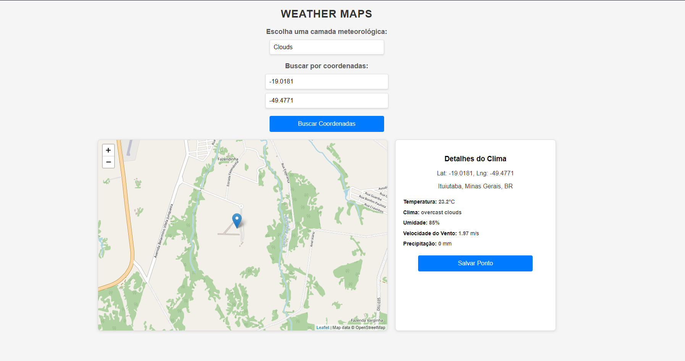
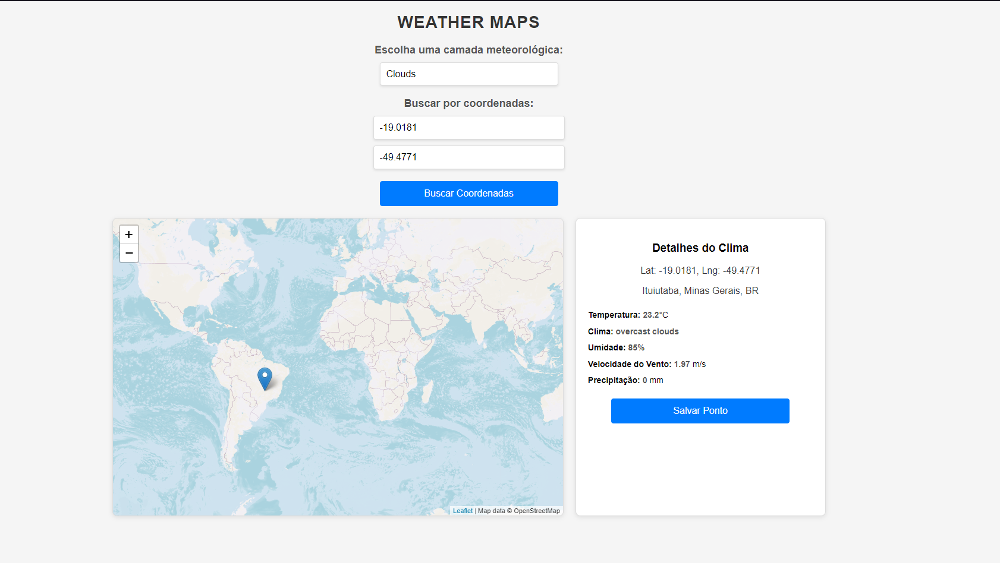
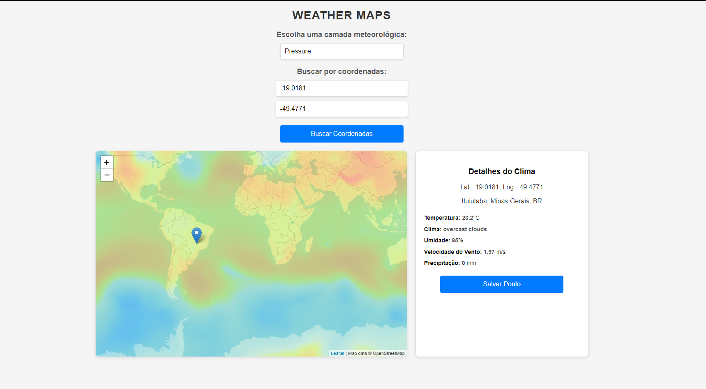
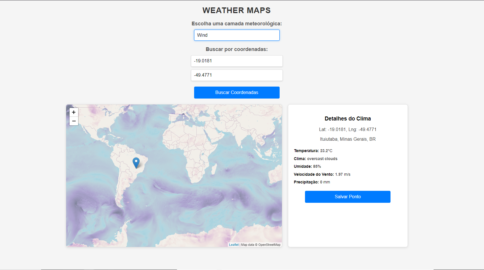
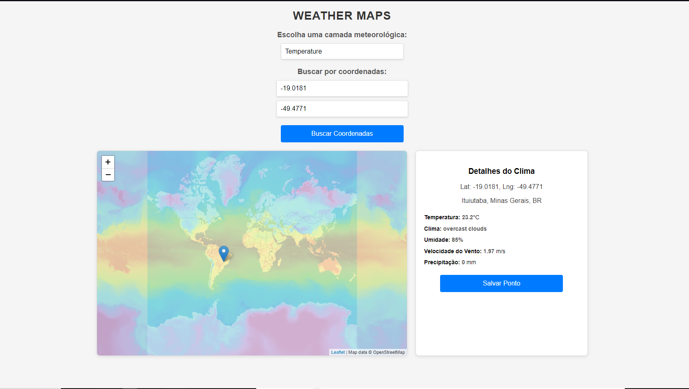

# Weather Maps 🌍

Este projeto é uma aplicação web baseada em **Django** com integração ao **Leaflet.js**, **OpenWeatherMap API** e **Celery**. Ele permite visualizar mapas meteorológicos, selecionar pontos no mapa para obter dados climáticos e salvar essas informações em um banco de dados. A aplicação também usa o **Redis** como backend para tarefas assíncronas.

---

## Funcionalidades Principais 🛠️

1. **Visualização de Camadas Meteorológicas**:
   - Cloud Coverage (Cobertura de Nuvens)
   - Precipitation (Precipitação)
   - Pressure (Pressão)
   - Wind (Vento)
   - Temperature (Temperatura)

2. **Seleção de Ponto no Mapa**:
   - Clique em qualquer lugar no mapa para exibir as coordenadas e os dados climáticos em tempo real.

3. **Salvamento de Pontos**:
   - Permite salvar um ponto selecionado no banco de dados com informações meteorológicas.

4. **Busca por Latitude e Longitude**:
   - Insira coordenadas específicas para marcar um ponto no mapa.

5. **Atualização Automática**:
   - Integração com **Celery** para atualizar os dados meteorológicos do ponto salvo a cada 15 minutos.

6. **Interface de Gerenciamento com Flower**:
   - Monitore tarefas Celery usando o painel **Flower**.

---

## Tecnologias Utilizadas 🛠️

- **Django**: Framework backend.
- **Celery**: Para tarefas assíncronas.
- **Redis**: Broker para o Celery.
- **Leaflet.js**: Biblioteca para mapas interativos.
- **OpenWeatherMap API**: API para dados meteorológicos.
- **Bootstrap**: Para estilização responsiva.

---

## Estrutura do Projeto 📁

```plaintext
weathermaps/
├── maps/
│   ├── migrations/
│   ├── static/
│   ├── templates/
│   │   ├── maps/
│   │   │   └── weather_map.html
│   ├── admin.py
│   ├── apps.py
│   ├── celery.py
│   ├── models.py
│   ├── tasks.py
│   ├── urls.py
│   ├── views.py
├── manage.py
├── weathermaps/
│   ├── __init__.py
│   ├── settings.py
│   ├── urls.py
│   ├── wsgi.py
```

## Pré-requisitos 🛠️
1. Python 3.9 ou superior
2. Redis instalado e configurado
3. API Key válida da OpenWeatherMap

## Configuração e Execução 🚀
1. Configure a API Key no settings.py

```plaintext
OPENWEATHER_API_KEY = 'sua_api_key'
````

2.4. Configure e Inicie o Redis
- Certifique-se de que o Redis está rodando:
```plaintext
redis-server
````
3. Execute as Migrações
```plaintext
python manage.py makemigrations
python manage.py migrate
```
4. Inicie o Celery
```plaintext
celery -A weathermaps worker --loglevel=info
```
5. Inicie o Flower para Monitoramento
```plaintext
celery -A weathermaps flower --port=5555
```
- Acesse o painel no navegador: http://127.0.0.1:5555

6. Inicie o Servidor Django
```plaintext
python manage.py runserver
```
- Acesse o aplicativo no navegador: http://127.0.0.1:8000

## Imagens do Projeto 🖼️

### Imagem 1: localização do ponto
Localização do ponto com as cordenadas setas na barra de buscar.



---

### Imagem 2: Mapa com Nuvem 



---

### Imagem 3: Mapa com preciptação


---

### Imagem 4: Mapa com pressão



---

### Imagem 5: Mapa com vento 



---

### Imagem 6: Mapa com temperatura


